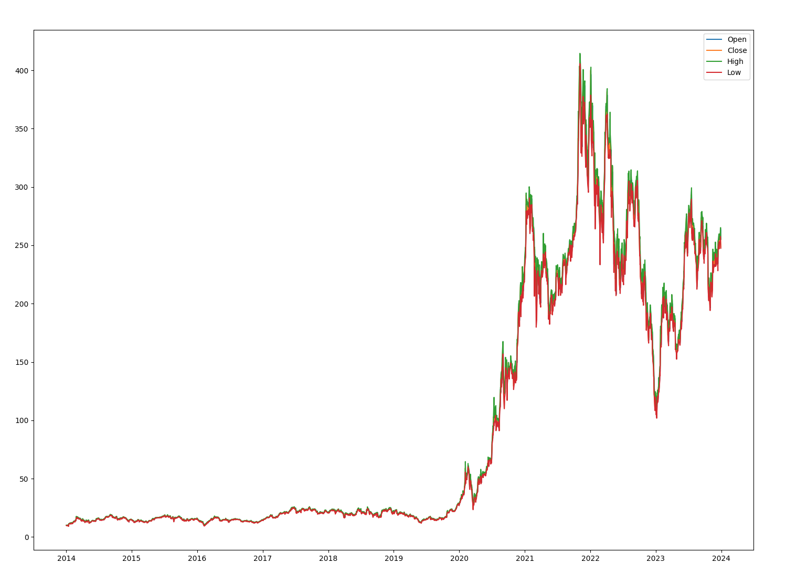
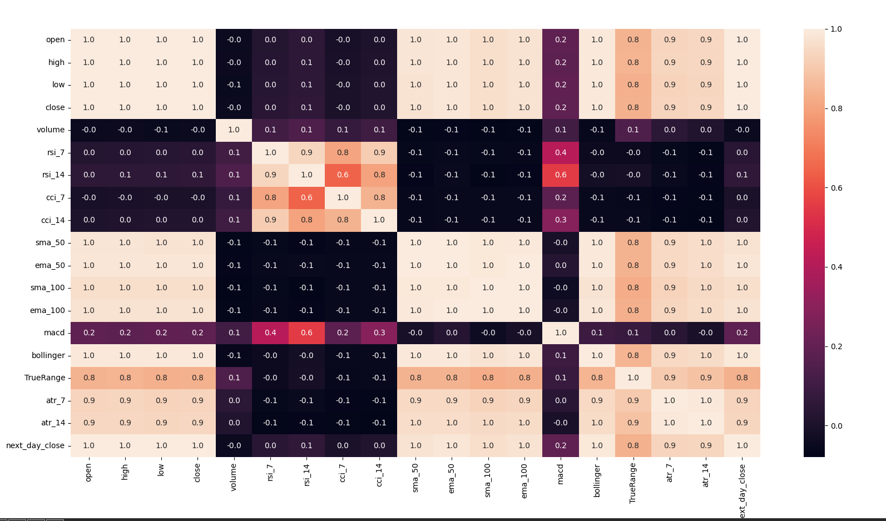

# Tesla Stock Price Prediction🚘🔋


## References

- [Day — 14: 30 Days Machine Learning Projects Challenge;
Tesla Stock Price Prediction🚘🔋] (https://medium.com/@iabbasali/day-14-30-days-machine-learning-projects-challenge-7cf2cdfeb800)

## Datasets

- [Tesla Stock Price With Indicators (10 Years)](https://www.kaggle.com/datasets/aspillai/tesla-stock-price-with-indicators-10-years/data)

## Code

- [app.py](https://github.com/donb4iu/30dayML/blob/main/30days/day14/app.py)

## Execution



```
#( 08/31/24@10:13AM )( donbuddenbaum@donbs-imac ):~/Documents/30dayML@main✗✗✗
   /Users/donbuddenbaum/.pyenv/versions/3.12.3/bin/python /Users/donbuddenbaum/Documents/30dayML/30days/day14/app.py
         date       open       high       low      close    volume      rsi_7     rsi_14  ...    sma_100   ema_100      macd  bollinger  TrueRange     atr_7    atr_14  next_day_close
0  2014-01-02   9.986667  10.165333  9.770000  10.006667  92826000  55.344071  54.440118  ...  10.494240  9.674284  0.169472   9.740800   0.395333  0.402641  0.447550        9.970667
1  2014-01-03  10.000000  10.146000  9.906667   9.970667  70425000  53.742629  53.821521  ...  10.495693  9.680190  0.162623   9.776167   0.239333  0.379311  0.432677        9.800000
2  2014-01-06  10.000000  10.026667  9.682667   9.800000  80416500  46.328174  50.870410  ...  10.496740  9.682577  0.141790   9.797900   0.344000  0.374267  0.426343        9.957333
3  2014-01-07   9.841333  10.026667  9.683333   9.957333  75511500  53.263037  53.406750  ...  10.503407  9.688051  0.136402   9.837900   0.343334  0.369848  0.420414       10.085333
4  2014-01-08   9.923333  10.246667  9.917333  10.085333  92448000  58.368660  55.423026  ...  10.511147  9.695964  0.140837   9.870167   0.329334  0.364060  0.413908        9.835333

[5 rows x 20 columns]
date              0
open              0
high              0
low               0
close             0
volume            0
rsi_7             0
rsi_14            0
cci_7             0
cci_14            0
sma_50            0
ema_50            0
sma_100           0
ema_100           0
macd              0
bollinger         0
TrueRange         0
atr_7             0
atr_14            0
next_day_close    0
dtype: int64
(2516, 20)
<class 'pandas.core.frame.DataFrame'>
RangeIndex: 2516 entries, 0 to 2515
Data columns (total 20 columns):
 #   Column          Non-Null Count  Dtype  
---  ------          --------------  -----  
 0   date            2516 non-null   object 
 1   open            2516 non-null   float64
 2   high            2516 non-null   float64
 3   low             2516 non-null   float64
 4   close           2516 non-null   float64
 5   volume          2516 non-null   int64  
 6   rsi_7           2516 non-null   float64
 7   rsi_14          2516 non-null   float64
 8   cci_7           2516 non-null   float64
 9   cci_14          2516 non-null   float64
 10  sma_50          2516 non-null   float64
 11  ema_50          2516 non-null   float64
 12  sma_100         2516 non-null   float64
 13  ema_100         2516 non-null   float64
 14  macd            2516 non-null   float64
 15  bollinger       2516 non-null   float64
 16  TrueRange       2516 non-null   float64
 17  atr_7           2516 non-null   float64
 18  atr_14          2516 non-null   float64
 19  next_day_close  2516 non-null   float64
dtypes: float64(18), int64(1), object(1)
memory usage: 393.3+ KB
None
                 open       high       low      close    volume      rsi_7     rsi_14       cci_7  ...    sma_100   ema_100      macd  bollinger  TrueRange     atr_7    atr_14  next_day_close
date                                                                                               ...                                                                                         
2014-01-02   9.986667  10.165333  9.770000  10.006667  92826000  55.344071  54.440118  -37.373644  ...  10.494240  9.674284  0.169472   9.740800   0.395333  0.402641  0.447550        9.970667
2014-01-03  10.000000  10.146000  9.906667   9.970667  70425000  53.742629  53.821521  -81.304471  ...  10.495693  9.680190  0.162623   9.776167   0.239333  0.379311  0.432677        9.800000
2014-01-06  10.000000  10.026667  9.682667   9.800000  80416500  46.328174  50.870410 -123.427544  ...  10.496740  9.682577  0.141790   9.797900   0.344000  0.374267  0.426343        9.957333
2014-01-07   9.841333  10.026667  9.683333   9.957333  75511500  53.263037  53.406750  -84.784651  ...  10.503407  9.688051  0.136402   9.837900   0.343334  0.369848  0.420414       10.085333
2014-01-08   9.923333  10.246667  9.917333  10.085333  92448000  58.368660  55.423026   60.799662  ...  10.511147  9.695964  0.140837   9.870167   0.329334  0.364060  0.413908        9.835333

[5 rows x 19 columns]
(2012, 18) (504, 18)
Linear Regression MAE: 2.3867493378878564
dtr_mae:  3.581458021825397
rfr_mae:  2.6890920889484113
svr_mae:  74.6380006751906
```