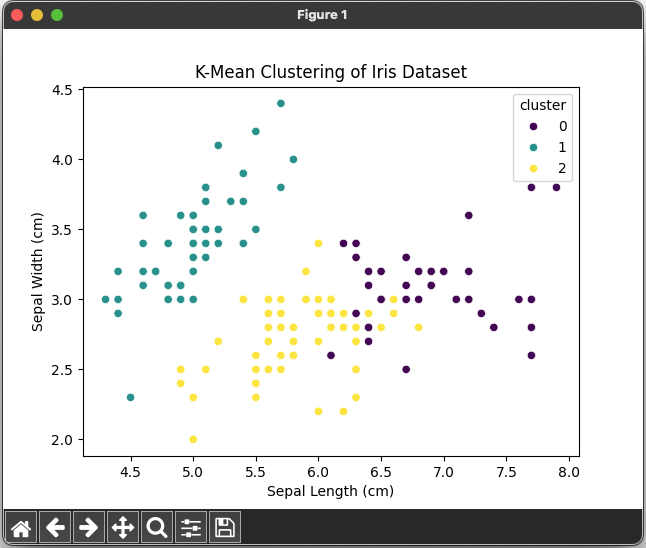

# Clustering Iris Dataset 🌷🌹🌼


## References

- [Day — 16: 30 Days Machine Learning Projects Challenge;
Clustering Iris Dataset🌷🌹🌼] (https://medium.com/@iabbasali/day-15-30-days-machine-learning-projects-challenge-da1a9bb77962)

## Datasets

- [Iris Dataset](https://www.kaggle.com/datasets/vikrishnan/iris-dataset)

## Code

- [app.py](https://github.com/donb4iu/30dayML/blob/main/30days/day16/app.py)

## Execution



```
#( 08/31/24@11:09AM )( donbuddenbaum@donbs-imac ):~/Documents/30dayML@main✗✗✗
   /Users/donbuddenbaum/.pyenv/versions/3.12.3/bin/python /Users/donbuddenbaum/Documents/30dayML/30days/day16/app.py
[1 1 1 1 1 1 1 1 1 1 1 1 1 1 1 1 1 1 1 1 1 1 1 1 1 1 1 1 1 1 1 1 1 1 1 1 1
 1 1 1 1 1 1 1 1 1 1 1 1 1 0 2 0 2 2 2 2 2 2 2 2 2 2 2 2 2 2 2 2 2 2 2 2 2
 2 2 2 0 2 2 2 2 2 2 2 2 2 2 2 2 2 2 2 2 2 2 2 2 2 2 0 2 0 0 0 0 2 0 0 0 0
 0 0 2 2 0 0 0 0 2 0 2 0 2 0 0 2 2 0 0 0 0 0 2 0 0 0 0 2 0 0 0 2 0 0 0 2 0
 0 2]
```