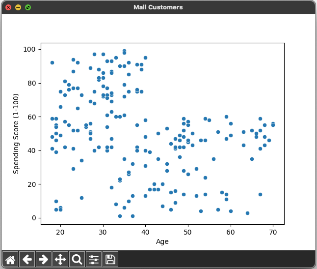

# Mall Customers Segmentation 🏬👨‍👩‍👧‍👦👩‍👧‍👦


## References

- [Day — 17: 30 Days Machine Learning Projects Challenge;
Mall Customers Segmentation 🏬👨‍👩‍👧‍👦👩‍👧‍👦](https://medium.com/@iabbasali/day-17-30-days-machine-learning-projects-challenge-a051bb2f9103)

## Datasets

- [Mall-customers-dataset](https://www.kaggle.com/datasets/sonalisingh1411/mallcustomersdataset)

## Code

- [app.py](https://github.com/donb4iu/30dayML/blob/main/30days/day17/app.py)

## Execution





```
#( 08/31/24@ 2:01PM )( donbuddenbaum@donbs-imac ):~/Documents/30dayML@main✗✗✗
   /Users/donbuddenbaum/.pyenv/versions/3.12.3/bin/python /Users/donbuddenbaum/Documents/30dayML/30days/day17/app.py
   CustomerID   Genre  Age  Annual Income (k$)  Spending Score (1-100)
0           1    Male   19                  15                      39
1           2    Male   21                  15                      81
2           3  Female   20                  16                       6
3           4  Female   23                  16                      77
4           5  Female   31                  17                      40
Index(['CustomerID', 'Genre', 'Age', 'Annual Income (k$)',
       'Spending Score (1-100)'],
      dtype='object')
CustomerID                0
Genre                     0
Age                       0
Annual Income (k$)        0
Spending Score (1-100)    0
dtype: int64
(200, 5)
<class 'pandas.core.frame.DataFrame'>
RangeIndex: 200 entries, 0 to 199
Data columns (total 5 columns):
 #   Column                  Non-Null Count  Dtype 
---  ------                  --------------  ----- 
 0   CustomerID              200 non-null    int64 
 1   Genre                   200 non-null    object
 2   Age                     200 non-null    int64 
 3   Annual Income (k$)      200 non-null    int64 
 4   Spending Score (1-100)  200 non-null    int64 
dtypes: int64(4), object(1)
memory usage: 7.9+ KB
None
       CustomerID         Age  Annual Income (k$)  Spending Score (1-100)
count  200.000000  200.000000          200.000000              200.000000
mean   100.500000   38.850000           60.560000               50.200000
std     57.879185   13.969007           26.264721               25.823522
min      1.000000   18.000000           15.000000                1.000000
25%     50.750000   28.750000           41.500000               34.750000
50%    100.500000   36.000000           61.500000               50.000000
75%    150.250000   49.000000           78.000000               73.000000
max    200.000000   70.000000          137.000000               99.000000
spending_by_gender:  Genre
Female    51.526786
Male      48.511364
Name: Spending Score (1-100), dtype: float64
X:  [[ 15  39]
 [ 15  81]
 [ 16   6]
 [ 16  77]
 [ 17  40]
 [ 17  76]
 [ 18   6]
 [ 18  94]
 [ 19   3]
 [ 19  72]
 [ 19  14]
 [ 19  99]
 [ 20  15]
 [ 20  77]
 [ 20  13]
 [ 20  79]
 [ 21  35]
 [ 21  66]
 [ 23  29]
 [ 23  98]
 [ 24  35]
 [ 24  73]
 [ 25   5]
 [ 25  73]
 [ 28  14]
 [ 28  82]
 [ 28  32]
 [ 28  61]
 [ 29  31]
 [ 29  87]
 [ 30   4]
 [ 30  73]
 [ 33   4]
 [ 33  92]
 [ 33  14]
 [ 33  81]
 [ 34  17]
 [ 34  73]
 [ 37  26]
 [ 37  75]
 [ 38  35]
 [ 38  92]
 [ 39  36]
 [ 39  61]
 [ 39  28]
 [ 39  65]
 [ 40  55]
 [ 40  47]
 [ 40  42]
 [ 40  42]
 [ 42  52]
 [ 42  60]
 [ 43  54]
 [ 43  60]
 [ 43  45]
 [ 43  41]
 [ 44  50]
 [ 44  46]
 [ 46  51]
 [ 46  46]
 [ 46  56]
 [ 46  55]
 [ 47  52]
 [ 47  59]
 [ 48  51]
 [ 48  59]
 [ 48  50]
 [ 48  48]
 [ 48  59]
 [ 48  47]
 [ 49  55]
 [ 49  42]
 [ 50  49]
 [ 50  56]
 [ 54  47]
 [ 54  54]
 [ 54  53]
 [ 54  48]
 [ 54  52]
 [ 54  42]
 [ 54  51]
 [ 54  55]
 [ 54  41]
 [ 54  44]
 [ 54  57]
 [ 54  46]
 [ 57  58]
 [ 57  55]
 [ 58  60]
 [ 58  46]
 [ 59  55]
 [ 59  41]
 [ 60  49]
 [ 60  40]
 [ 60  42]
 [ 60  52]
 [ 60  47]
 [ 60  50]
 [ 61  42]
 [ 61  49]
 [ 62  41]
 [ 62  48]
 [ 62  59]
 [ 62  55]
 [ 62  56]
 [ 62  42]
 [ 63  50]
 [ 63  46]
 [ 63  43]
 [ 63  48]
 [ 63  52]
 [ 63  54]
 [ 64  42]
 [ 64  46]
 [ 65  48]
 [ 65  50]
 [ 65  43]
 [ 65  59]
 [ 67  43]
 [ 67  57]
 [ 67  56]
 [ 67  40]
 [ 69  58]
 [ 69  91]
 [ 70  29]
 [ 70  77]
 [ 71  35]
 [ 71  95]
 [ 71  11]
 [ 71  75]
 [ 71   9]
 [ 71  75]
 [ 72  34]
 [ 72  71]
 [ 73   5]
 [ 73  88]
 [ 73   7]
 [ 73  73]
 [ 74  10]
 [ 74  72]
 [ 75   5]
 [ 75  93]
 [ 76  40]
 [ 76  87]
 [ 77  12]
 [ 77  97]
 [ 77  36]
 [ 77  74]
 [ 78  22]
 [ 78  90]
 [ 78  17]
 [ 78  88]
 [ 78  20]
 [ 78  76]
 [ 78  16]
 [ 78  89]
 [ 78   1]
 [ 78  78]
 [ 78   1]
 [ 78  73]
 [ 79  35]
 [ 79  83]
 [ 81   5]
 [ 81  93]
 [ 85  26]
 [ 85  75]
 [ 86  20]
 [ 86  95]
 [ 87  27]
 [ 87  63]
 [ 87  13]
 [ 87  75]
 [ 87  10]
 [ 87  92]
 [ 88  13]
 [ 88  86]
 [ 88  15]
 [ 88  69]
 [ 93  14]
 [ 93  90]
 [ 97  32]
 [ 97  86]
 [ 98  15]
 [ 98  88]
 [ 99  39]
 [ 99  97]
 [101  24]
 [101  68]
 [103  17]
 [103  85]
 [103  23]
 [103  69]
 [113   8]
 [113  91]
 [120  16]
 [120  79]
 [126  28]
 [126  74]
 [137  18]
 [137  83]]
[184131.885027885, 154609.8703489493, 73880.64496247195, 44448.45544793371, 38858.9599751439, 31969.426550235472, 29829.73963965766, 28268.81430258338, 21681.522257128836]
Centers:  [[86.53846154 82.12820513]
 [25.72727273 79.36363636]
 [88.2        17.11428571]
 [26.30434783 20.91304348]
 [55.2962963  49.51851852]]
[3 1 3 1 3 1 3 1 3 1 3 1 3 1 3 1 3 1 3 1 3 1 3 1 3 1 3 1 3 1 3 1 3 1 3 1 3
 1 3 1 3 1 3 4 3 1 4 4 4 4 4 4 4 4 4 4 4 4 4 4 4 4 4 4 4 4 4 4 4 4 4 4 4 4
 4 4 4 4 4 4 4 4 4 4 4 4 4 4 4 4 4 4 4 4 4 4 4 4 4 4 4 4 4 4 4 4 4 4 4 4 4
 4 4 4 4 4 4 4 4 4 4 4 4 0 2 0 4 0 2 0 2 0 4 0 2 0 2 0 2 0 2 0 4 0 2 0 2 0
 2 0 2 0 2 0 2 0 2 0 2 0 2 0 2 0 2 0 2 0 2 0 2 0 2 0 2 0 2 0 2 0 2 0 2 0 2
 0 2 0 2 0 2 0 2 0 2 0 2 0 2 0]
```