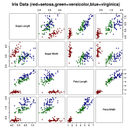
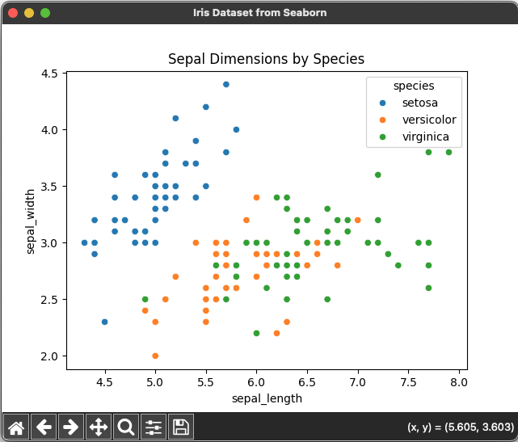

# KMeans, DBSCAN, and PCA 🫧



## References

- [Day — 18: 30 Days Machine Learning Projects Challenge;
KMeans, DBSCAN, and PCA🫧](https://medium.com/@iabbasali/day-18-30-days-machine-learning-projects-challenge-330eb5cdd7a8)

## Datasets

- [Iris Dataset](https://www.kaggle.com/datasets/vikrishnan/iris-dataset)
- [MNIST Hand-Written Digits Recognition✍️🔢](https://www.kaggle.com/c/digit-recognizer)

## Code

- [app.py](https://github.com/donb4iu/30dayML/blob/main/30days/day18/app.py)
- [app2.py](https://github.com/donb4iu/30dayML/blob/main/30days/day18/app2.py)

## Execution

### app.py




```
#( 08/31/24@ 2:46PM )( donbuddenbaum@donbs-imac ):~/Documents/30dayML@main✗✗✗
   /Users/donbuddenbaum/.pyenv/versions/3.12.3/bin/python /Users/donbuddenbaum/Documents/30dayML/30days/day18/app.py
   sepal_length  sepal_width  petal_length  petal_width species
0           5.1          3.5           1.4          0.2  setosa
1           4.9          3.0           1.4          0.2  setosa
2           4.7          3.2           1.3          0.2  setosa
3           4.6          3.1           1.5          0.2  setosa
4           5.0          3.6           1.4          0.2  setosa
Index(['sepal_length', 'sepal_width', 'petal_length', 'petal_width',
       'species'],
      dtype='object')
sepal_length    0
sepal_width     0
petal_length    0
petal_width     0
species         0
dtype: int64
(150, 5)
<class 'pandas.core.frame.DataFrame'>
RangeIndex: 150 entries, 0 to 149
Data columns (total 5 columns):
 #   Column        Non-Null Count  Dtype  
---  ------        --------------  -----  
 0   sepal_length  150 non-null    float64
 1   sepal_width   150 non-null    float64
 2   petal_length  150 non-null    float64
 3   petal_width   150 non-null    float64
 4   species       150 non-null    object 
dtypes: float64(4), object(1)
memory usage: 6.0+ KB
None
       sepal_length  sepal_width  petal_length  petal_width
count    150.000000   150.000000    150.000000   150.000000
mean       5.843333     3.057333      3.758000     1.199333
std        0.828066     0.435866      1.765298     0.762238
min        4.300000     2.000000      1.000000     0.100000
25%        5.100000     2.800000      1.600000     0.300000
50%        5.800000     3.000000      4.350000     1.300000
75%        6.400000     3.300000      5.100000     1.800000
max        7.900000     4.400000      6.900000     2.500000
[1 1 1 1 1 1 1 1 1 1 1 1 1 1 1 1 1 1 1 1 1 1 1 1 1 1 1 1 1 1 1 1 1 1 1 1 1
 1 1 1 1 1 1 1 1 1 1 1 1 1 0 2 0 2 2 2 2 2 2 2 2 2 2 2 2 2 2 2 2 2 2 2 2 2
 2 2 0 0 2 2 2 2 2 2 2 2 2 2 2 2 2 2 2 2 2 2 2 2 1 2 0 2 0 0 0 0 2 0 0 0 0
 0 0 2 2 0 0 0 0 2 0 2 0 2 0 0 2 2 0 0 0 0 0 0 0 0 0 0 2 0 0 0 2 0 0 0 2 0
 0 2]
[0 0 0 0 0 0 0 0 0 0 0 0 0 0 0 0 0 0 0 0 0 0 0 0 0 0 0 0 0 0 0 0 0 0 0 0 0
 0 0 0 0 0 0 0 0 0 0 0 0 0 1 1 1 1 1 1 1 1 1 1 1 1 1 1 1 1 1 1 1 1 1 1 1 1
 1 1 1 1 1 1 1 1 1 1 1 1 1 1 1 1 1 1 1 1 1 1 1 1 1 1 1 1 1 1 1 1 1 1 1 1 1
 1 1 1 1 1 1 1 1 1 1 1 1 1 1 1 1 1 1 1 1 1 1 1 1 1 1 1 1 1 1 1 1 1 1 1 1 1
 1 1]
```

### app2.py


```
#( 08/31/24@ 3:39PM )( donbuddenbaum@donbs-imac ):~/Documents/30dayML@main✗✗✗
   /Users/donbuddenbaum/.pyenv/versions/3.12.3/bin/python /Users/donbuddenbaum/Documents/30dayML/30days/day18/app2.py
loading 30days/day18/data/mnist_784.pkl.
[[ 0.47943237  1.24013272]
 [ 3.96272158  1.13711224]
 [-0.23135666 -1.54391155]
 ...
 [-1.06473339 -2.31403333]
 [-1.21656793  0.45775353]
 [ 4.15240049  0.32702956]]
```