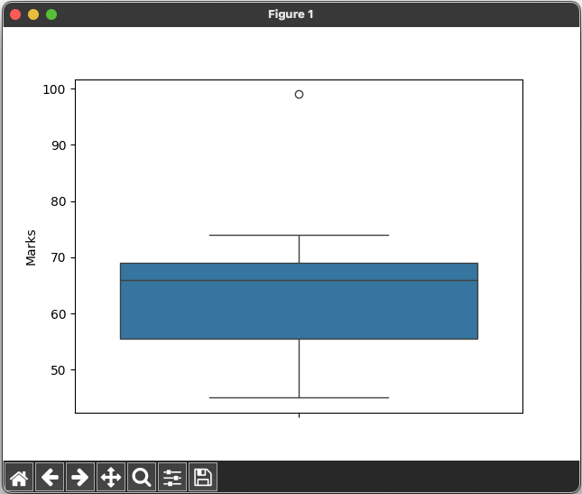

# Anomaly Detection Using Isolation Forest 🙂😚💩😌😉


## References

- [Day — 20: 30 Days Machine Learning Projects Challenge;
Anomaly Detection Using Isolation Forest 🙂😚💩😌😉](https://medium.com/@iabbasali/day-19-30-days-machine-learning-projects-challenge-2a376b9d3438)

## Datasets
**Didn't Use**
- [Anomaly Detection](https://www.kaggle.com/c/anomaly-detection)   

## Code

- [app.py](https://github.com/donb4iu/30dayML/blob/main/30days/day20/app.py)


## Execution



```
#( 08/31/24@ 5:05PM )( donbuddenbaum@donbs-imac ):~/Documents/30dayML@main✗✗✗
   /Users/donbuddenbaum/.pyenv/versions/3.12.3/bin/python /Users/donbuddenbaum/Documents/30dayML/30days/day20/app.py
   StudentId  Marks
0          1     67
1          2     56
2          3     66
3          4     74
4          5     70
    StudentId  Marks  Outlier
0           1     67        1
1           2     56        1
2           3     66        1
3           4     74        1
4           5     70        1
5           6     45        1
6           7     55        1
7           8     59        1
8           9     69        1
9          10     99       -1
10         11     68        1
11         12     51        1
12         13     60        1
13         14     69        1
14         15     50        1

```