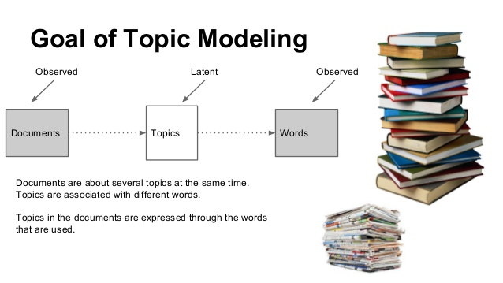

# Topic Modeling Using LDA 📑



## References

- [Day — 21: 30 Days Machine Learning Projects Challenge;
Topic Modeling Using LDA 📑](https://medium.com/@iabbasali/day-21-30-days-machine-learning-projects-challenge-a01ea184634e)

## Datasets
**Didn't Use**
- [Topic Modeling](https://www.kaggle.com/code/akashram/topic-modeling-intro-implementation)   

## Code

- [app.py](https://github.com/donb4iu/30dayML/blob/main/30days/day21/app.py)


## Execution

```
#( 08/31/24@ 5:22PM )( donbuddenbaum@donbs-imac ):~/Documents/30dayML@main✗✗✗
   /Users/donbuddenbaum/.pyenv/versions/3.12.3/bin/python /Users/donbuddenbaum/Documents/30dayML/30days/day21/app.py
Technology:
- Smartphones are an essential piece of technology in today's digital age.
- Electric vehicles represent a significant advancement in automotive technology.
- Artificial intelligence is being integrated into various aspects of modern technology.
- Participating in sports promotes physical fitness and overall well-being.

Sports:
- Professional athletes train rigorously to excel in their respective sports.
- Watching sports events live offers an exhilarating experience for fans.
- Virtual reality technology immerses users in simulated environments for gaming and entertainment.
- Sports equipment manufacturers continually innovate to improve performance and safety.

Topic 0:
technology various integrated intelligence modern
Topic 1:
sports manufacturers performance continually equipment

```