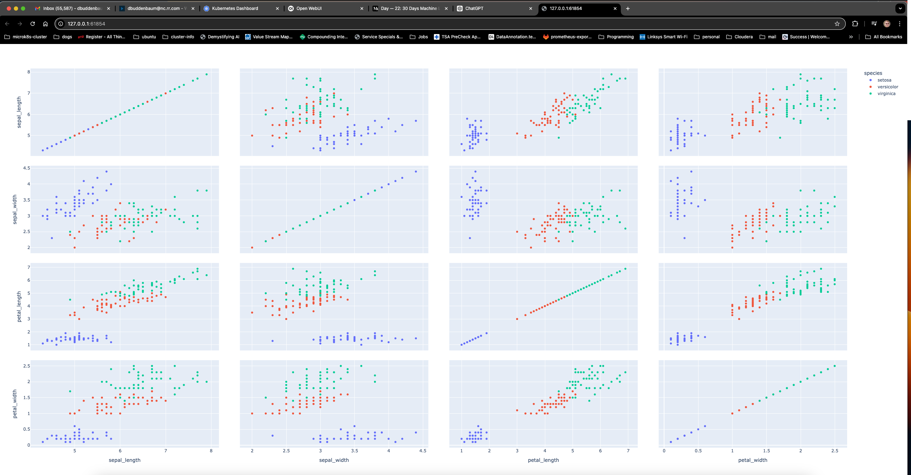

# Dimensionality Reduction Using t-SNE And UMAP 🍞


## References

- [A Complete Guide On Dimensionality Reduction](https://medium.com/analytics-vidhya/a-complete-guide-on-dimensionality-reduction-62d9698013d2)
- [Practical Example of Dimensionality Reduction](https://towardsdatascience.com/practical-example-of-dimensionality-reduction-d0525632c355)
- [Day — 22: 30 Days Machine Learning Projects Challenge;
Dimensionality Reduction Using t-SNE And UMAP 🍞](https://medium.com/@iabbasali/day-22-30-days-machine-learning-projects-challenge-616f3dd0582f)

## Datasets

- [Iris Dataset](https://www.kaggle.com/datasets/vikrishnan/iris-dataset)   

**Didn't Use**

- [Dimensionality reduction techniques](https://www.kaggle.com/code/remidi/dimensionality-reduction-techniques)

## Code

- [app.py](https://github.com/donb4iu/30dayML/blob/main/30days/day22/app.py)


## Execution



```
#( 08/31/24@ 6:29PM )( donbuddenbaum@donbs-imac ):~/Documents/30dayML@main✗✗✗
   /Users/donbuddenbaum/.pyenv/versions/3.12.3/bin/python /Users/donbuddenbaum/Documents/30dayML/30days/day22/app.py
   sepal_length  sepal_width  petal_length  petal_width species  species_id
0           5.1          3.5           1.4          0.2  setosa           1
1           4.9          3.0           1.4          0.2  setosa           1
2           4.7          3.2           1.3          0.2  setosa           1
3           4.6          3.1           1.5          0.2  setosa           1
4           5.0          3.6           1.4          0.2  setosa           1
/Users/donbuddenbaum/.pyenv/versions/3.12.3/lib/python3.12/site-packages/umap/umap_.py:1945: UserWarning:

n_jobs value 1 overridden to 1 by setting random_state. Use no seed for parallelism.

/Users/donbuddenbaum/.pyenv/versions/3.12.3/lib/python3.12/site-packages/umap/umap_.py:1945: UserWarning:

n_jobs value 1 overridden to 1 by setting random_state. Use no seed for parallelism.

```