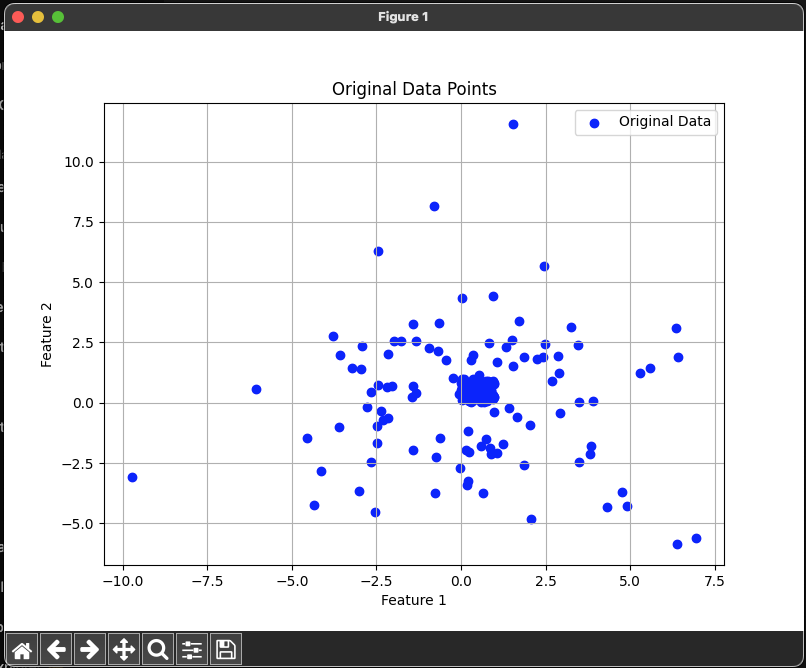

# Anomaly Detection Using Isolation Forest and Local Outlier Factor 1️⃣1️⃣–11️⃣1️⃣


## References


- [Day — 23: 30 Days Machine Learning Projects Challenge;
Anomaly Detection Using Isolation Forest and Local Outlier Factor 1️⃣1️⃣–11️⃣1️⃣](https://medium.com/@iabbasali/day-23-30-days-machine-learning-projects-challenge-b31a054c6030)


## Datasets

**Didn't use**
- [Anomaly Detection](https://www.kaggle.com/c/anomaly-detection)   

## Code

- [app.py](https://github.com/donb4iu/30dayML/blob/main/30days/day23/app.py)

## Execution



```

```