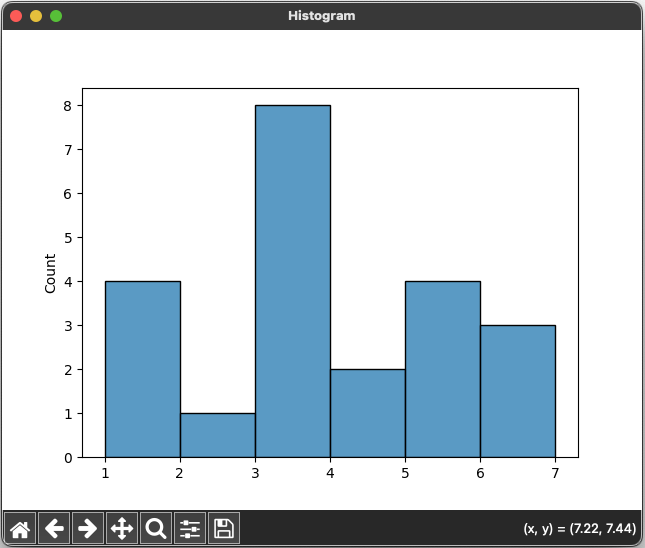

# Kernel Density Estimation Using Seaborn 📊⛰️


## References


- [Day — 24: 30 Days Machine Learning Projects Challenge;
Kernel Density Estimation Using Seaborn 📊⛰️](https://medium.com/@iabbasali/day-24-30-days-machine-learning-projects-challenge-8823494d40aa)

- [Histograms vs. KDEs Explaine](https://towardsdatascience.com/histograms-vs-kdes-explained-ed62e7753f12)

## Datasets

**Didn't use**
- [Kernel Density Estimation CSV](https://www.kaggle.com/datasets/stanleychen13123/kernel-density-estimation-csv)   

## Code

- [app.py](https://github.com/donb4iu/30dayML/blob/main/30days/day24/app.py)

## Execution



```
#( 09/01/24@11:40AM )( donbuddenbaum@donbs-imac ):~/Documents/30dayML@main✗✗✗
   /Users/donbuddenbaum/.pyenv/versions/3.12.3/bin/python /Users/donbuddenbaum/Documents/30dayML/30days/day24/app.py
/Users/donbuddenbaum/Documents/30dayML/30days/day24/app.py:14: UserWarning: 

The `bw` parameter is deprecated in favor of `bw_method` and `bw_adjust`.
Setting `bw_method=0.1`, but please see the docs for the new parameters
and update your code. This will become an error in seaborn v0.14.0.

  sns.kdeplot(sample, bw=0.1)
    mpg  cylinders  displacement  horsepower  weight  acceleration  model_year origin                       name
0  18.0          8         307.0       130.0    3504          12.0          70    usa  chevrolet chevelle malibu
1  15.0          8         350.0       165.0    3693          11.5          70    usa          buick skylark 320
2  18.0          8         318.0       150.0    3436          11.0          70    usa         plymouth satellite
3  16.0          8         304.0       150.0    3433          12.0          70    usa              amc rebel sst
4  17.0          8         302.0       140.0    3449          10.5          70    usa                ford torino
5
[8 4 6 3 5]
/Users/donbuddenbaum/Documents/30dayML/30days/day24/app.py:28: FutureWarning: 

`shade` is now deprecated in favor of `fill`; setting `fill=True`.
This will become an error in seaborn v0.14.0; please update your code.

  sns.kdeplot(car.cylinders, shade=True)
mpg             0
cylinders       0
displacement    0
horsepower      6
weight          0
acceleration    0
model_year      0
origin          0
name            0
dtype: int64
/Users/donbuddenbaum/Documents/30dayML/30days/day24/app.py:36: FutureWarning: 

`shade` is now deprecated in favor of `fill`; setting `fill=True`.
This will become an error in seaborn v0.14.0; please update your code.

  sns.kdeplot(car.horsepower, shade=True)
/Users/donbuddenbaum/Documents/30dayML/30days/day24/app.py:41: UserWarning: 

The `bw` parameter is deprecated in favor of `bw_method` and `bw_adjust`.
Setting `bw_method=0.002`, but please see the docs for the new parameters
and update your code. This will become an error in seaborn v0.14.0.

  sns.kdeplot(car.horsepower, shade=True, bw=0.002)
/Users/donbuddenbaum/Documents/30dayML/30days/day24/app.py:41: FutureWarning: 

`shade` is now deprecated in favor of `fill`; setting `fill=True`.
This will become an error in seaborn v0.14.0; please update your code.

  sns.kdeplot(car.horsepower, shade=True, bw=0.002)
/Users/donbuddenbaum/Documents/30dayML/30days/day24/app.py:58: FutureWarning: 

`shade` is now deprecated in favor of `fill`; setting `fill=True`.
This will become an error in seaborn v0.14.0; please update your code.

  sns.kdeplot(data=car, x=car.mpg, y=car.horsepower, hue=car.cylinders, shade=True, cbar=True)
```