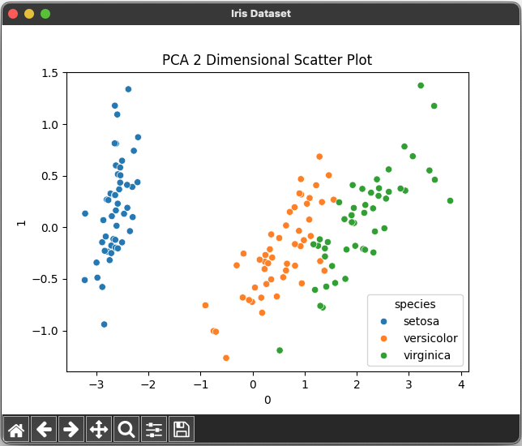
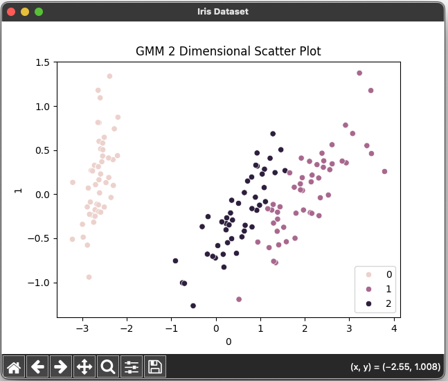

# Clustering Using GMM, KMeans, and DBSCAN 🧛‍♂️🧛🧛🧜‍♀️🧜‍♂️🧜


## References

- [Day — 27: 30 Days Machine Learning Projects Challenge;
Clustering Using GMM, KMeans, and DBSCAN 🧛‍♂️🧛🧛🧜‍♀️🧜‍♂️🧜](https://medium.com/@iabbasali/day-27-30-days-machine-learning-projects-challenge-2f5d78c62d17)


## Datasets

- [seaborn](https://seaborn.pydata.org/examples/index.html)   

## Code

- [app.py](https://github.com/donb4iu/30dayML/blob/main/30days/day27/app.py)

## Execution
 
 
 
 
 
 
 
```
 #( 09/01/24@ 2:51PM )( donbuddenbaum@donbs-imac ):~/Documents/30dayML@main✗✗✗
   /Users/donbuddenbaum/.pyenv/versions/3.12.3/bin/python /Users/donbuddenbaum/Documents/30dayML/30days/day27/app.py
   sepal_length  sepal_width  petal_length  petal_width species
0           5.1          3.5           1.4          0.2  setosa
1           4.9          3.0           1.4          0.2  setosa
2           4.7          3.2           1.3          0.2  setosa
3           4.6          3.1           1.5          0.2  setosa
4           5.0          3.6           1.4          0.2  setosa 
```