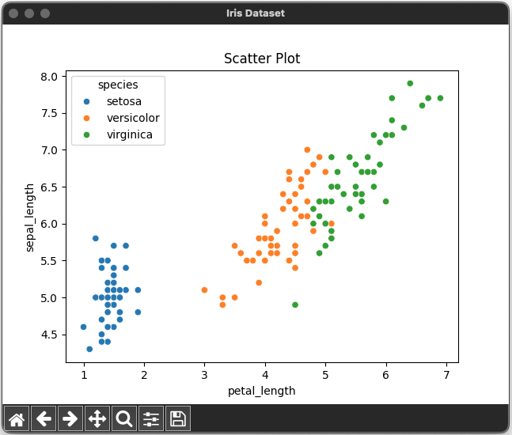
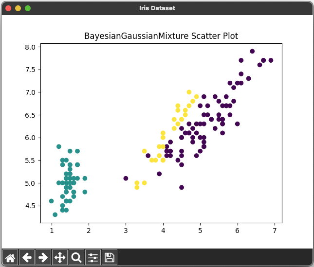

# Clustering Using Bayesian Gaussian Mixture 🌷🌼🌺


## References

- [Day — 29: 30 Days Machine Learning Projects Challenge;
Clustering Using Bayesian Gaussian Mixture 🌷🌼🌺](https://medium.com/@iabbasali/day-29-30-days-machine-learning-projects-challenge-8d46d1758e54)


## Datasets

- [iris](https://seaborn.pydata.org/examples/index.html)   

## Code

- [app.py](https://github.com/donb4iu/30dayML/blob/main/30days/day29/app.py)

## Execution
  
 
 
```
 #( 09/01/24@ 3:36PM )( donbuddenbaum@donbs-imac ):~/Documents/30dayML@main✗✗✗
   /Users/donbuddenbaum/.pyenv/versions/3.12.3/bin/python /Users/donbuddenbaum/Documents/30dayML/30days/day29/app.py
[1 1 1 1 1 1 1 1 1 1 1 1 1 1 1 1 1 1 1 1 1 1 1 1 1 1 1 1 1 1 1 1 1 1 1 1 1
 1 1 1 1 1 1 1 1 1 1 1 1 1 2 2 2 2 2 0 0 2 2 0 2 0 2 0 0 2 0 0 0 2 0 2 2 0
 2 2 2 0 0 2 2 2 2 0 0 0 2 2 0 2 0 0 2 2 0 0 0 2 0 0 0 0 0 0 0 0 0 0 0 0 0
 0 0 0 0 0 0 0 0 0 0 0 0 0 0 0 0 0 0 0 0 0 0 0 0 0 0 0 0 0 0 0 0 0 0 0 0 0
 0 0] 
```