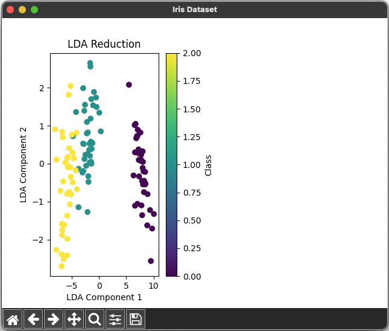
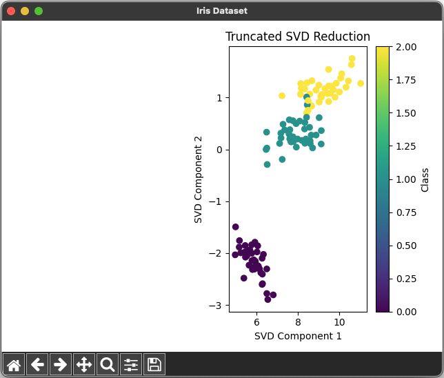

# Dimensionality Reduction Using LDA and SVD 🤏


## References

- [Day — 30: 30 Days Machine Learning Projects Challenge;
Dimensionality Reduction Using LDA and SVD 🤏](https://medium.com/@iabbasali/day-30-30-days-machine-learning-projects-challenge-5b59bdec4e94)


## Datasets

- [iris](https://seaborn.pydata.org/examples/index.html)   

## Code

- [app.py](https://github.com/donb4iu/30dayML/blob/main/30days/day30/app.py)

## Execution
 
 
```
 
```