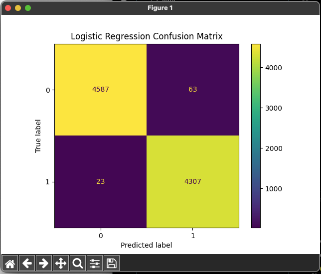
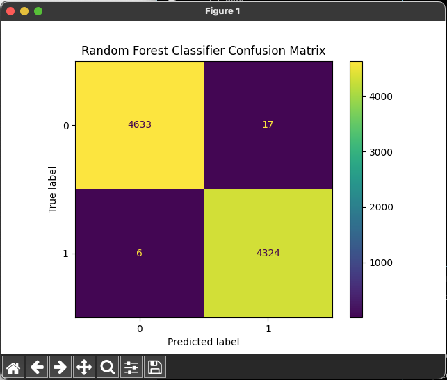

# Fake News Detection ML


## Repo

https://github.com/donb4iu/fake_news

## References

- [Fake News Detection: An End-to-End Machine Learning Project](https://medium.com/@alperakis/fake-news-detection-an-end-to-end-machine-learning-project-a9c9f59f4cc7) 
- [Dockerizing a Python Flask App: A Step-by-Step Guide to Containerizing Your Web Application](https://medium.com/@geeekfa/dockerizing-a-python-flask-app-a-step-by-step-guide-to-containerizing-your-web-application-d0f123159ba2)

## Datasets

- [fake-and-real-news-dataset](https://www.kaggle.com/code/therealsampat/fake-news-detection/input)   
- [nltk.download('stopwords') - For more information see: https://www.nltk.org/data.html](https://www.nltk.org/data.html)

##  Fixes 

Clean text on Post to clean up the vectoriztion so stop words are not counted as features.

## Code

- [app.py](https://github.com/donb4iu/fake_news/blob/main/app/FakeNewsDetection:AnEnd-to-EndMachineLearningProject/app.py)
- [convert2json.py](https://github.com/donb4iu/fake_news/blob/main/app/FakeNewsDetection:AnEnd-to-EndMachineLearningProject/convert2json.py)
- [etl.py](https://github.com/donb4iu/fake_news/blob/main/app/FakeNewsDetection:AnEnd-to-EndMachineLearningProject/etl.py)

## Build

### Docker Build
docker buildx create --use --name temp-builder

docker buildx build --platform linux/amd64,linux/arm64 -f Dockerfile --build-arg BUILDKIT_STEP_LOG_MAX_SIZE=10485760 --build-arg BUILDKIT_STEP_LOG_MAX_SPEED=10485760 -t donb4iu/app-fakenews-flask --push .

docker buildx rm temp-builder

### Docker Run
```

```

## Execution





```
#( 09/03/24@ 3:53PM )( donbuddenbaum@donbs-imac ):~/Documents/fake_news@main✗✗✗
   /Users/donbuddenbaum/.pyenv/versions/3.12.3/bin/python "/Users/donbuddenbaum/Documents/fake_news/app/Fake News Detection: An End-to-End Machine Learning Project/etl.py"
Logistic Regression Accuracy: 0.9904231625835189
              precision    recall  f1-score   support

           0       1.00      0.99      0.99      4650
           1       0.99      0.99      0.99      4330

    accuracy                           0.99      8980
   macro avg       0.99      0.99      0.99      8980
weighted avg       0.99      0.99      0.99      8980

Random Forest Classifier Accuracy: 0.9974387527839643
              precision    recall  f1-score   support

           0       1.00      1.00      1.00      4650
           1       1.00      1.00      1.00      4330

    accuracy                           1.00      8980
   macro avg       1.00      1.00      1.00      8980
weighted avg       1.00      1.00      1.00      8980

#( 09/03/24@ 4:18PM )( donbuddenbaum@donbs-imac ):~/Documents/fake_news@main✗✗✗
   /Users/donbuddenbaum/.pyenv/versions/3.12.3/bin/python "/Users/donbuddenbaum/Documents/fake_news/app/Fake News Detection: An End-to-End Machine Learning Project/app.py"
 * Serving Flask app 'app'
 * Debug mode: on
WARNING: This is a development server. Do not use it in a production deployment. Use a production WSGI server instead.
 * Running on http://127.0.0.1:5000
Press CTRL+C to quit
 * Restarting with watchdog (fsevents)
 * Debugger is active!
 * Debugger PIN: 144-463-593

```

## Testing the Fake_News RF Classifier Model

### Test a file {'text':' text to predict'}

curl -X POST -H "Content-Type: application/json" -d @yourfile.json http://127.0.0.1:8080/predict/json

#### Fake:  

curl -X POST -H "Content-Type: application/json" -d @news_fake.json http://127.0.0.1:8080/predict/json

      {"prediction":0}


#### Real:

curl -X POST -H "Content-Type: application/json" -d @news_true.json http://127.0.0.1:8080/predict/json

      {"prediction":1}

### Test a website - {'url':' url to website content to predict'}

curl -X POST -H "Content-Type: application/json" -d '{"url": "Your url to article text here"}' http://127.0.0.1:8080/predict/url


#### Fake:

curl -X POST -H "Content-Type: application/json" -d '{"url": "https://www.dailymail.co.uk/tvshowbiz/article-5874213/Did-Miley-Cyrus-Liam-Hemsworth-secretly-married.html"}' http://127.0.0.1:8080/predict/url

      {"prediction":0}

#### Real:

curl -X POST -H "Content-Type: application/json" -d '{"url": "https://americanjournalnews.com/evolution-denier-mark-robinson-could-reshape-north-carolinas-education-system/"}' http://127.0.0.1:8080/predict/url

      {"prediction":1}


## Kubernetes 

### Setup

#### #( 09/07/24@ 8:39PM )( donbuddenbaum@donbs-imac ):~/Documents/Kalaxy2/markdown@main✔
   helm install fakenews-release ~/Documents/Kalaxy2/helm/kalaxy2_charts/app-fakenews-flask-0.3.0.tgz

### Test with Postman

```
curl --location 'https://predicturl.donb4iu.com/predict/url' --header 'CF-Access-Client-ID: ${{client_id}}' --header 'CF-Access-Client-Secret: ${{cleint_secret}}' --data '{"url": "https://www.dailymail.co.uk/tvshowbiz/article-5874213/Did-Miley-Cyrus-Liam-Hemsworth-secretly-married.html"}'
```

