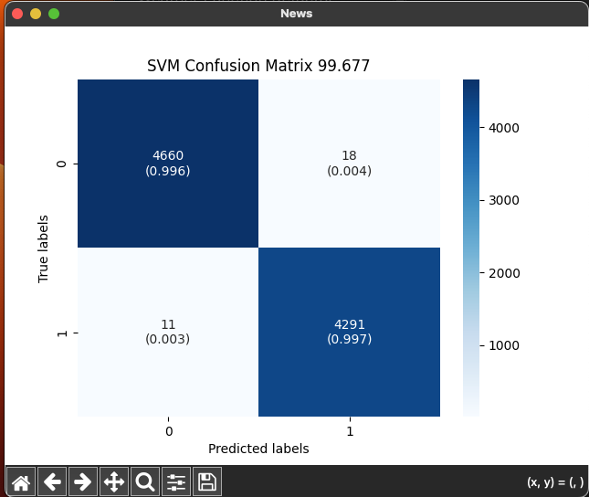

#  Fake News Detection - NLP


## References

- [Fake News Detection using NLP techniques](https://medium.com/analytics-vidhya/fake-news-detection-using-nlp-techniques-c2dc4be05f99)

## Datasets

- [fake-and-real-news-dataset](https://www.kaggle.com/mrisdal/fake-and-real-news-dataset)   

- [nltk.download('stopwords' - For more information see: https://www.nltk.org/data.html](https://www.nltk.org/data.html)

## Code

- [app.py](https://github.com/donb4iu/fake_news/blob/main/app/FakeNewsDetectionusingNLPtechniques/app.py)

## Execution





```
#( 09/02/24@10:45PM )( donbuddenbaum@donbs-imac ):~/Documents/fake_news@main✗✗✗
   /Users/donbuddenbaum/.pyenv/versions/3.12.3/bin/python /Users/donbuddenbaum/Documents/fake_news/app/app.py
title      0
text       0
subject    0
date       0
label      0
dtype: int64
NB accuracy:   93.909
SVM accuracy:   99.677
PAC accuracy:   99.621
```