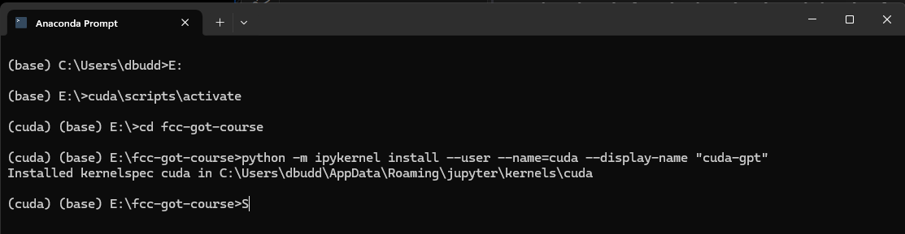
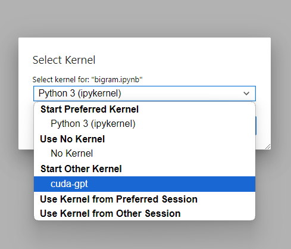

# FreeCodeCamp - Building LLMs from Scratch


## References

### Google Colab for those who don't have a GPU: https://colab.research.google.com/drive/1_7TNpEEl8xjHlr9JzKbK5AuDKXwAkHqj?usp=sharing

Dependencies (assuming windows): `pip install pylzma numpy ipykernel jupyter torch --index-url https://download.pytorch.org/whl/cu118`

If you don't have an NVIDIA GPU, then the `device` parameter will default to `'cpu'` since `device = 'cuda' if torch.cuda.is_available() else 'cpu'`. If device is defaulting to `'cpu'` that is fine, you will just experience slower runtimes.

### All the links you should need are in this repo. I will add detailed explanations as questions and issues are posted.

### Visual Studio 2022 (for lzma compression algo) - https://visualstudio.microsoft.com/downloads/

### OpenWebText Download
- https://skylion007.github.io/OpenWebTextCorpus/
- if this doesn't work, default to the wizard of oz mini dataset for training / validation

### Socials
Twitter / X - https://twitter.com/elliotarledge

My YouTube Channel - https://www.youtube.com/channel/UCjlt_l6MIdxi4KoxuMjhYxg

How to SSH from Mac to Windows - https://www.youtube.com/watch?v=7hBeAb6WyIg&t=

How to Setup Jupyter Notebooks in 5 minutes or less - https://www.youtube.com/watch?v=eLmweqU5VBA&t=

Linkedin - https://www.linkedin.com/in/elliot-arledge-a392b7243/

Join My Discord Server - https://discord.gg/pV7ByF9VNm

Schedule a 1-on-1: https://calendly.com/elliot-ayxc/60min

### Research Papers:
Attention is All You Need - https://arxiv.org/pdf/1706.03762.pdf

A Survey of LLMs - https://arxiv.org/pdf/2303.18223.pdf

QLoRA: Efficient Finetuning of Quantized LLMs - https://arxiv.org/pdf/2305.14314.pdf

- [How to Build a Large Language Model from Scratch Using Python](https://www.freecodecamp.org/news/how-to-build-a-large-language-model-from-scratch-using-python/)

- [](https://pytorch.org/get-started/locally/)

- [A Survey of Large Language Models](https://arxiv.org/abs/2303.18223)


### Optimizer Notes

***need to familiarize audience with optimizers (AdamW, Adam, SGD, MSE…) no need to jump into the formulas, just what the optimizer does for us and some of the differences/similarities between them***

1. **Mean Squared Error (MSE)**: MSE is a common loss function used in regression problems, where the goal is to predict a continuous output. It measures the average squared difference between the predicted and actual values, and is often used to train neural networks for regression tasks.
1. **Gradient Descent (GD):**  is an optimization algorithm used to minimize the loss function of a machine learning model. The loss function measures how well the model is able to predict the target variable based on the input features. The idea of GD is to iteratively adjust the model parameters in the direction of the steepest descent of the loss function
1. **Momentum**: Momentum is an extension of SGD that adds a "momentum" term to the parameter updates. This term helps smooth out the updates and allows the optimizer to continue moving in the right direction, even if the gradient changes direction or varies in magnitude. Momentum is particularly useful for training deep neural networks.
1. **RMSprop**: RMSprop is an optimization algorithm that uses a moving average of the squared gradient to adapt the learning rate of each parameter. This helps to avoid oscillations in the parameter updates and can improve convergence in some cases.
1. **Adam**: Adam is a popular optimization algorithm that combines the ideas of momentum and RMSprop. It uses a moving average of both the gradient and its squared value to adapt the learning rate of each parameter. Adam is often used as a default optimizer for deep learning models.
1. **AdamW**: AdamW is a modification of the Adam optimizer that adds weight decay to the parameter updates. This helps to regularize the model and can improve generalization performance. We will be using the AdamW optimizer as it best suits the properties of the model we will train in this video.

find more optimizers and details at torch.optim


## Datasets

- [Creative Commons Licensed Books](https://www.gutenberg.org/)
    - [Wizared of Oz](https://www.gutenberg.org/cache/epub/22566/pg22566.txt)

- [OpenWebTextCorpus](https://huggingface.co/datasets/Kunj07/openwebtext/tree/main)

## Setup

```
(base) E:\fcc-got-course>python -m venv cuda
(base) E:\fcc-got-course>cuda\scripts\activate
pip install fqdn
pip install jsonschema
pip install matplotlib numpy pylzma ipykernel jupyter
pip3 install torch --index-url https://download.pytorch.org/whl/cu118

(cuda) (base) E:\fcc-got-course>python -m ipykernel install --user --name=cuda --display-name "cuda-gpt"
Installed kernelspec cuda in C:\Users\dbudd\AppData\Roaming\jupyter\kernels\cuda
```

## Execution



### (cuda) (base) E:\fcc-got-course>jupyter notebook
```
[I 2024-10-03 14:21:04.210 ServerApp] jupyter_lsp | extension was successfully linked.
[I 2024-10-03 14:21:04.217 ServerApp] jupyter_server_terminals | extension was successfully linked.
[I 2024-10-03 14:21:04.225 ServerApp] jupyterlab | extension was successfully linked.
[I 2024-10-03 14:21:04.231 ServerApp] notebook | extension was successfully linked.
[I 2024-10-03 14:21:04.544 ServerApp] notebook_shim | extension was successfully linked.
[I 2024-10-03 14:21:04.596 ServerApp] notebook_shim | extension was successfully loaded.
[I 2024-10-03 14:21:04.598 ServerApp] jupyter_lsp | extension was successfully loaded.
[I 2024-10-03 14:21:04.599 ServerApp] jupyter_server_terminals | extension was successfully loaded.
[I 2024-10-03 14:21:04.605 LabApp] JupyterLab extension loaded from E:\cuda\Lib\site-packages\jupyterlab
[I 2024-10-03 14:21:04.605 LabApp] JupyterLab application directory is E:\cuda\share\jupyter\lab
[I 2024-10-03 14:21:04.606 LabApp] Extension Manager is 'pypi'.
[I 2024-10-03 14:21:04.950 ServerApp] jupyterlab | extension was successfully loaded.
[I 2024-10-03 14:21:04.956 ServerApp] notebook | extension was successfully loaded.
[I 2024-10-03 14:21:04.957 ServerApp] Serving notebooks from local directory: E:\fcc-got-course
[I 2024-10-03 14:21:04.957 ServerApp] Jupyter Server 2.14.2 is running at:
[I 2024-10-03 14:21:04.957 ServerApp] http://localhost:8888/tree?token=03b646e7c956690216689547560509e6a88a3f06bde2b563
[I 2024-10-03 14:21:04.957 ServerApp]     http://127.0.0.1:8888/tree?token=03b646e7c956690216689547560509e6a88a3f06bde2b563
[I 2024-10-03 14:21:04.958 ServerApp] Use Control-C to stop this server and shut down all kernels (twice to skip confirmation).
[C 2024-10-03 14:21:05.053 ServerApp]

    To access the server, open this file in a browser:
        file:///C:/Users/dbudd/AppData/Roaming/jupyter/runtime/jpserver-10772-open.html
    Or copy and paste one of these URLs:
        http://localhost:8888/tree?token=03b646e7c956690216689547560509e6a88a3f06bde2b563
        http://127.0.0.1:8888/tree?token=03b646e7c956690216689547560509e6a88a3f06bde2b563
[I 2024-10-03 14:21:05.349 ServerApp] Skipped non-installed server(s): bash-language-server, dockerfile-language-server-nodejs, javascript-typescript-langserver, jedi-language-server, julia-language-server, pyright, python-language-server, python-lsp-server, r-languageserver, sql-language-server, texlab, typescript-language-server, unified-language-server, vscode-css-languageserver-bin, vscode-html-languageserver-bin, vscode-json-languageserver-bin, yaml-language-server
```

