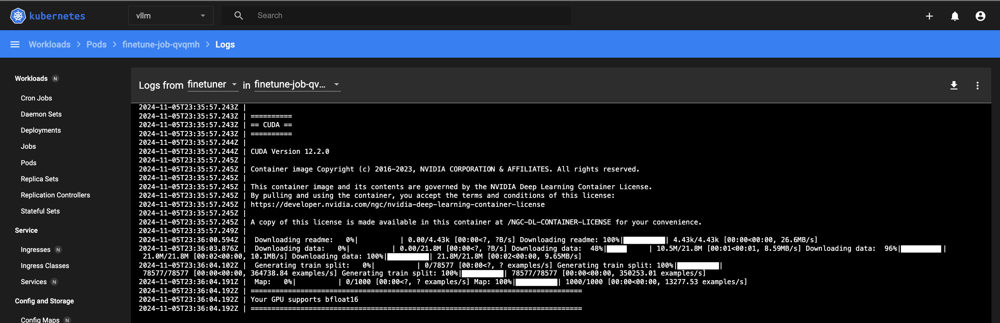

# Fine Tuning


## References

- [Kalaxy2 Hosting vLLM](../hosting/vllm.md)

- [Fine-tune Gemma open models using multiple GPUs on GKE](https://cloud.google.com/kubernetes-engine/docs/tutorials/finetune-gemma-gpu)

- [GenAI Model Optimization: Guide to Fine-Tuning and Quantization](https://medium.com/@alibaba-cloud/genai-model-optimization-guide-to-fine-tuning-and-quantization-431d10db332a)

- [A New Study Compares RAG & Fine-Tuning For Knowledge Base Use-Cases](https://medium.com/@cobusgreyling/a-new-study-compares-rag-fine-tuning-for-knowledge-base-use-cases-fa2383357fba)

## Image Build

### cuda 12.2.0

docker build -t donb4iu/finetune-gemma-gpu:cuda12.2.0 --push .

(base) #( 11/05/24@ 5:37PM )( donbuddenbaum@donbs-imac ):~/Documents/Kalaxy2/yaml/llm-finetuning-gemma@main✗✗✗
   docker build -t donb4iu/finetune-gemma-gpu:cuda12.2.0 --push .

```
[+] Building 1871.9s (11/11) FINISHED                                                                               docker:desktop-linux
 => [internal] load build definition from Dockerfile                                                                                0.0s
 => => transferring dockerfile: 1.17kB                                                                                              0.0s
 => [internal] load metadata for docker.io/nvidia/cuda:12.2.0-runtime-ubuntu22.04                                                   1.3s
 => [auth] nvidia/cuda:pull token for registry-1.docker.io                                                                          0.0s
 => [internal] load .dockerignore                                                                                                   0.0s
 => => transferring context: 2B                                                                                                     0.0s
 => [1/4] FROM docker.io/nvidia/cuda:12.2.0-runtime-ubuntu22.04@sha256:739e0bde7bafdb2ed9057865f53085539f51cbf8bd6bf719f2e114bab  142.5s
 => => resolve docker.io/nvidia/cuda:12.2.0-runtime-ubuntu22.04@sha256:739e0bde7bafdb2ed9057865f53085539f51cbf8bd6bf719f2e114bab32  0.0s
 => => sha256:739e0bde7bafdb2ed9057865f53085539f51cbf8bd6bf719f2e114bab321e70e 743B / 743B                                          0.0s
 => => sha256:370f16e473527763fc5f78bb8bb06c76c13b692c7255405e8497df022527281d 2.21kB / 2.21kB                                      0.0s
 => => sha256:5f87b1ee9f9af968f84779dd3166023fb545818e0e8d572f5ca7dbc2499377d2 12.17kB / 12.17kB                                    0.0s
 => => sha256:8054e9d6e8d6718cc3461aa4172ad048564cdf9f552c8f9820bd127859aa007c 56.08MB / 56.08MB                                   25.4s
 => => sha256:aece8493d3972efa43bfd4ee3cdba659c0f787f8f59c82fb3e48c87cbb22a12e 29.54MB / 29.54MB                                   12.8s
 => => sha256:9fe5ccccae45d6811769206667e494085cb511666be47b8e659087c249083c3f 4.62MB / 4.62MB                                      1.8s
 => => sha256:bdddd5cb92f6b4613055bcbcd3226df9821c7facd5af9a998ba12dae080ef134 185B / 185B                                          1.9s
 => => sha256:5324914b447286e0e6512290373af079a25f94499a379e642774245376e60885 6.89kB / 6.89kB                                      2.0s
 => => sha256:9a9dd462fc4c5ca1dd29994385be60a5bb359843fc93447331b8c97dfec99bf9 1.10GB / 1.10GB                                    107.8s
 => => sha256:95eef45e00fabd2bce97586bfe26be456b0e4b3ef3d88d07a8b334ee05cc603c 63.35kB / 63.35kB                                   13.0s
 => => extracting sha256:aece8493d3972efa43bfd4ee3cdba659c0f787f8f59c82fb3e48c87cbb22a12e                                           7.4s
 => => sha256:e2554c2d377e1176c0b8687b17aa7cbe2c48746857acc11686281a4adee35a0a 1.69kB / 1.69kB                                     13.2s
 => => sha256:4640d022dbb8eb47da53ccc2de59f8f5e780ea046289ba3cffdf0a5bd8d19810 1.52kB / 1.52kB                                     13.4s
 => => extracting sha256:9fe5ccccae45d6811769206667e494085cb511666be47b8e659087c249083c3f                                           1.3s
 => => extracting sha256:8054e9d6e8d6718cc3461aa4172ad048564cdf9f552c8f9820bd127859aa007c                                           5.2s
 => => extracting sha256:bdddd5cb92f6b4613055bcbcd3226df9821c7facd5af9a998ba12dae080ef134                                           0.0s
 => => extracting sha256:5324914b447286e0e6512290373af079a25f94499a379e642774245376e60885                                           0.0s
 => => extracting sha256:9a9dd462fc4c5ca1dd29994385be60a5bb359843fc93447331b8c97dfec99bf9                                          34.0s
 => => extracting sha256:95eef45e00fabd2bce97586bfe26be456b0e4b3ef3d88d07a8b334ee05cc603c                                           0.0s
 => => extracting sha256:e2554c2d377e1176c0b8687b17aa7cbe2c48746857acc11686281a4adee35a0a                                           0.0s
 => => extracting sha256:4640d022dbb8eb47da53ccc2de59f8f5e780ea046289ba3cffdf0a5bd8d19810                                           0.0s
 => [internal] load build context                                                                                                   0.0s
 => => transferring context: 33B                                                                                                    0.0s
 => [2/4] RUN apt-get update &&     apt-get -y --no-install-recommends install python3-dev gcc python3-pip git &&     rm -rf /var  40.7s
 => [3/4] RUN pip3 install --no-cache-dir     accelerate==0.30.1 bitsandbytes==0.43.1     datasets==2.19.1 transformers==4.41.0   419.1s
 => [4/4] COPY finetune.py /finetune.py                                                                                             0.1s
 => exporting to image                                                                                                             54.4s
 => => exporting layers                                                                                                            54.3s
 => => writing image sha256:ccc3051d94c13b6e5a1a78ba5115d1623cb7b201b51cede21dea6d397d0c03d0                                        0.0s
 => => naming to docker.io/donb4iu/finetune-gemma-gpu:cuda12.2.0                                                                    0.0s
 => pushing donb4iu/finetune-gemma-gpu:cuda12.2.0 with docker                                                                    1212.3s
 => => pushing layer d9620b935b94                                                                                                1211.7s
 => => pushing layer e5554561df61                                                                                                1209.8s
 => => pushing layer 0c311111544d                                                                                                 102.0s
 => => pushing layer d7ea66469795                                                                                                1211.7s
 => => pushing layer cd08f63effcf                                                                                                1211.7s
 => => pushing layer 3afff21308c2                                                                                                1211.7s
 => => pushing layer fdfb7cb43648                                                                                                1211.7s
 => => pushing layer 863984995e20                                                                                                1211.7s
 => => pushing layer f6922d7436ee                                                                                                1211.7s
 => => pushing layer 2468321ae51b                                                                                                1211.7s
 => => pushing layer c0d9ea20683b                                                                                                1211.7s
 => => pushing layer 256d88da4185                                                                                                1211.7s

 2 warnings found (use docker --debug to expand):
 - JSONArgsRecommended: JSON arguments recommended for CMD to prevent unintended behavior related to OS signals (line 31)
 - LegacyKeyValueFormat: "ENV key=value" should be used instead of legacy "ENV key value" format (line 29)
```

(base) #( 11/05/24@ 6:18PM )( donbuddenbaum@donbs-imac ):~/Documents/Kalaxy2/yaml/llm-finetuning-gemma@main✗✗✗
   kubectl apply -f finetune.yaml
job.batch/finetune-job created

## Setup

### (base) #( 11/05/24@ 6:18PM )( donbuddenbaum@donbs-imac ):~/Documents/Kalaxy2/yaml/llm-finetuning-gemma@main✗✗✗
   kubectl apply -f finetune.yaml

    job.batch/finetune-job created


## Execution



## Dataset


## Serving
### #(base) #( 11/06/24@ 7:09PM )( donbuddenbaum@donbs-imac ):~/Documents/Kalaxy2/yaml/llm-finetuning-gemma@main✗✗✗
   kubectl create -f deployment.yaml

    deployment.apps/vllm-gemma-deployment created
    service/llm-service created


### Curling

#### #(base) #( 11/08/24@ 5:53PM )( donbuddenbaum@donbs-imac ):~
```
   USER_PROMPT="Question: What is the total number of attendees with age over 30 at kubecon eu? Context: CREATE TABLE attendees (name VARCHAR, age INTEGER, kubecon VARCHAR)"

curl -X POST http://192.168.2.41:8000/generate \
  -H "Content-Type: application/json" \
  -d @- <<EOF
{
    "prompt": "${USER_PROMPT}",
    "temperature": 0.1,
    "top_p": 1.0,
    "max_tokens": 24
}
EOF
```
```
{"predictions":["Prompt:\nQuestion: What is the total number of attendees with age over 30 at kubecon eu? Context: CREATE TABLE attendees (name VARCHAR, age INTEGER, kubecon VARCHAR)\nOutput:\nAnswer: SELECT COUNT(age) FROM attendees WHERE kubecon = \"kubecon eu\" AND age > 3"]}%
```
## Gradio Chat


## Notes

### 1 

#### Error
```
2024-11-06T00:11:09.628Z | `config.hidden_act` is ignored, you should use `config.hidden_activation` instead.
2024-11-06T00:11:09.628Z | Gemma's activation function will be set to `gelu_pytorch_tanh`. Please, use
2024-11-06T00:11:09.628Z | `config.hidden_activation` if you want to override this behaviour.
2024-11-06T00:11:09.628Z | See https://github.com/huggingface/transformers/pull/29402 for more details.
```
#### Solution: Set activation function with new parameter


    model.config.hidden_activation = "gelu_pytorch_tanh"  # or use any other activation function you prefer


```
2024-11-06T00:12:56.525Z | /usr/local/lib/python3.10/dist-packages/huggingface_hub/file_download.py:797: FutureWarning: `resume_download` is deprecated and will be removed in version 1.0.0. Downloads always resume when possible. If you want to force a new download, use `force_download=True`.
```

### 2

#### Error

```
2024-11-06T00:12:56.525Z | /usr/local/lib/python3.10/dist-packages/huggingface_hub/file_download.py:797: FutureWarning: `resume_download` is deprecated and will be removed in version 1.0.0. Downloads always resume when possible. If you want to force a new download, use `force_download=True`.
```
### Solution: Set `force_download = True

```
# Replace resume_download with force_download=True if you want a fresh download
file_path = hf_hub_download(
    repo_id="your-repo-id",
    filename="your-filename",
    force_download=True  # forces a fresh download
)
```
